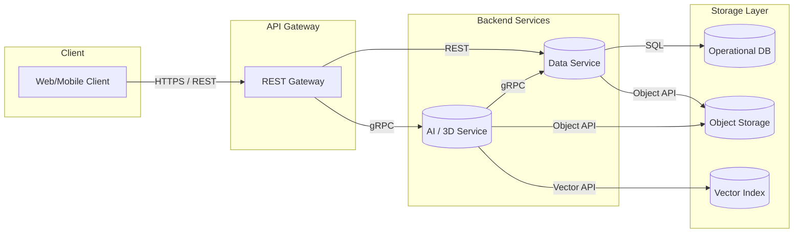

# System Architecture Overview

## Component Responsibilities

| Component | Description |
| --- | --- |
| Client | React/Next.js application delivering 3D experiences and AI-assisted design tools. Interacts with the API Gateway over HTTPS using REST and subscribes to real-time updates through WebSocket. |
| API Gateway | Single entry point for clients. Terminates TLS, performs authentication/authorization, request validation, rate limiting, and routes requests to backend services. Provides REST endpoints and WebSocket channels. |
| Data Service | Manages domain entities (projects, assets, sessions). Exposes RESTful CRUD APIs to the gateway and communicates with AI/3D service over gRPC for enriched data. Interfaces with relational database and object storage. |
| AI/3D Service | Hosts AI inference pipelines and 3D asset processing. Offers gRPC APIs for low-latency inference and WebSocket event publishing for stream updates. Stores generated assets in object storage and embeddings in vector database. |
| Storage | Operational database for transactional data, object storage for assets and generated outputs, vector index for embeddings and semantic search. |

## Service Interfaces

| Consumer | Provider | Purpose | Protocol |
| --- | --- | --- | --- |
| Client | API Gateway | CRUD operations, configuration, and session management | REST (HTTPS) |
| Client | API Gateway | Real-time status updates and progress streams | WebSocket |
| API Gateway | Data Service | Domain data operations | REST |
| API Gateway | AI/3D Service | Trigger AI inference and 3D pipeline jobs | gRPC |
| AI/3D Service | Data Service | Persist inference results and metadata | gRPC |
| Services | Storage | Persistent data operations | SQL / S3-compatible / gRPC |

## Data Flow Summary

1. The client sends REST requests to the API Gateway to create or update projects, upload references, and request AI/3D jobs.
2. The API Gateway authenticates the user and forwards domain data operations to the Data Service via REST.
3. AI-specific requests are converted into gRPC calls to the AI/3D Service, which performs inference or asset generation.
4. The AI/3D Service stores results and artifacts in Object Storage and Vector Database, notifying the Data Service of completion.
5. The Data Service updates the operational database and emits events that the API Gateway pushes to subscribed clients over WebSocket.
